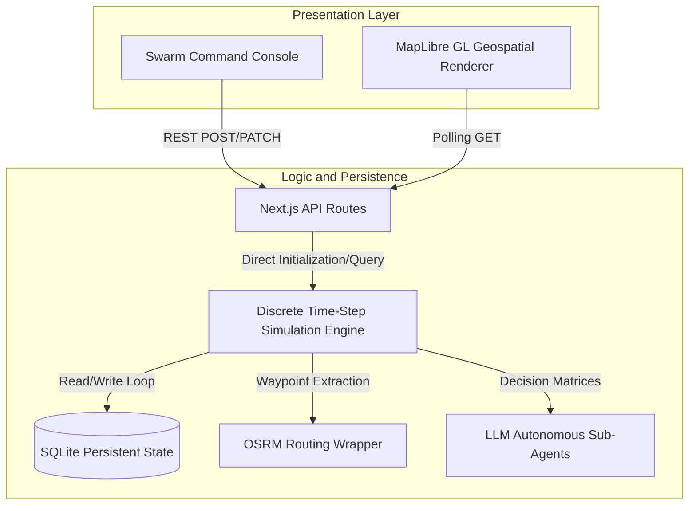
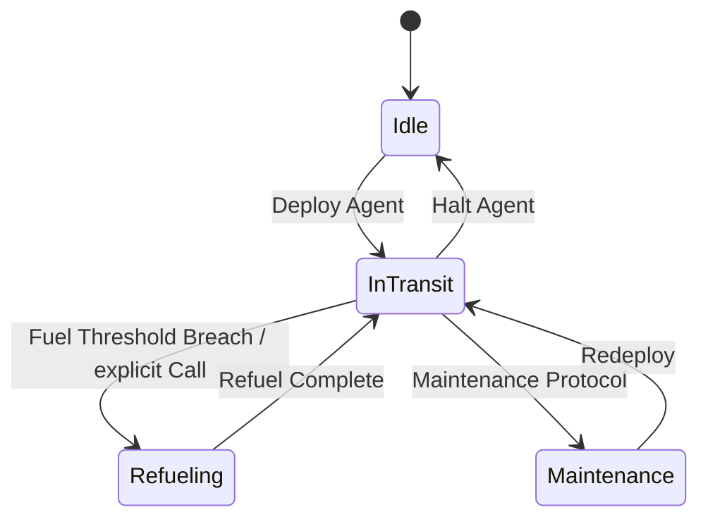

# Autonomous Fleet Simulation Engine

This repository contains the architecture and implementation of a high-performance, real-time autonomous routing and simulation suite. The engine specializes in modeling highly dense urban traffic networks, applying predictive algorithmic adjustments to multi-agent vehicle routing, and establishing strict state-based topological mapping in Euclidean space.

## Structural Overview

The core simulation is executed server-side via a deterministic time-step tick engine. The frontend serves as a live rendering layer utilizing linear interpolation across geospatial planes.

## Physical State Constraints and Teleportation Protocol

The system manages physical constraints by separating vehicles into "Transit" and "Stationary" operational spaces. A continuous Cartesian validation loop acts upon all active agents to prevent positional drift.

### Warehouse and Logistical Docking Mechanism

When an agent enters a `maintenance` state, the grid constraint algorithm bypasses typical Cartesian road traversal and enacts a geospatial teleportation routine to the nearest logistics hub. 

Given an arbitrary continuous space and a discrete set of target facilities $F_1, F_2, \dots, F_k$, the engine evaluates the Haversine distance from the current coordinate agent position $p_0$ to each candidate location $p_i$, formalizing as:

$$d_i = 2R \arcsin\left(\sqrt{\sin^2\left(\frac{\phi_i - \phi_0}{2}\right) + \cos(\phi_0)\cos(\phi_i)\sin^2\left(\frac{\lambda_i - \lambda_0}{2}\right)}\right)$$

Where:
- $\phi$ represents latitude.
- $\lambda$ represents longitude.
- $R$ is the planetary volumetric radius.

The chosen subset teleportation coordinates map strictly to:
$$T_{hub} = \arg\min_{F_i} (d_i)$$

This deterministic evaluation guarantees minimal topological displacement during maintenance execution.

## Time-Step Traversal Algorithm

Within the `in-transit` state execution loop, velocity computations are iteratively processed to determine coordinate displacement per computational tick. 

The positional vector $V_n$ at iteration $n+1$ relies heavily on the temporal scale matrix $\Delta t$, adjusting linearly against traffic-imposed drag constants $(C_d)$.

The displacement function can be simplified mathematically as:
$$D_{tick} = \left( V_{base} \times C_d \right) \cdot \left( \frac{\Delta t}{3600} \right) \cdot S$$

Where:
- $V_{base}$ is predefined class-based velocity.
- $C_d$ is the traffic congestion coefficient $(0.0 \le C_d \le 1.0)$.
- $S$ is the simulation speed multiplier constraint.

The iterative progression over defined OSRM interpolations enables fluid tracking and trajectory correction.

## Autonomous Agent Rerouting Metrics

For optimization within urban zones affected by severe incident saturation, the routing module shifts paths dynamically. 

Each generated alternate route $R$ comprises a set of sequential nodes $N_1, N_2... N_m$. The optimization function attempts to minimize global penalty weights:

$$W(R) = \sum_{j=1}^{m} D(N_{j-1}, N_j) + \beta \sum_{k=1}^{n} I(O_k, R) + \gamma \sum_{c=1}^{q} C(Z_c, R)$$

Where:
- $D$ is the temporal driving metric.
- $I(O_k, R)$ evaluates incident intersection penalties.
- $C(Z_c, R)$ attributes delay penalties for macro-congestion zones.

Applying these equations produces rapid structural reorganization of the fleet, yielding maximum logistical throughput while neutralizing gridlock cascading.

## Deployment Strategy

Execution requires isolated environments handling Next.js instances aligned against standardized Node modules. 

1. Synchronize repository state.
2. Verify SQLite indexing schemas.
3. Establish runtime variables via local environment.
4. Execute via primary thread.

Validation passes should automatically confirm map tile fetching, OSRM stability, and background tick consistency.
