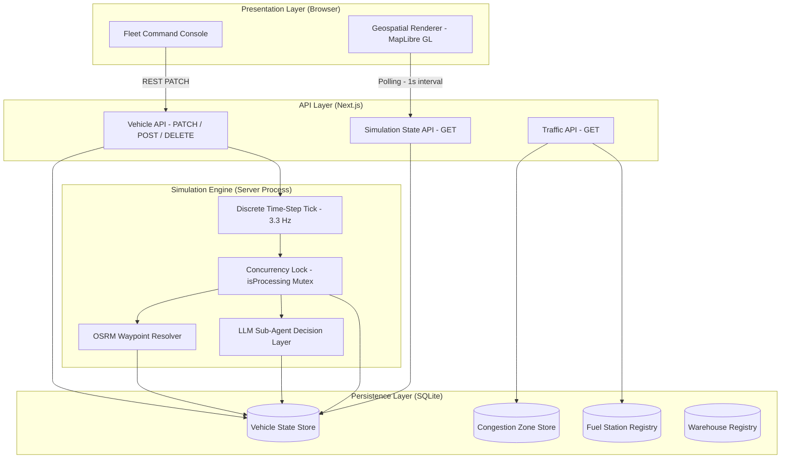
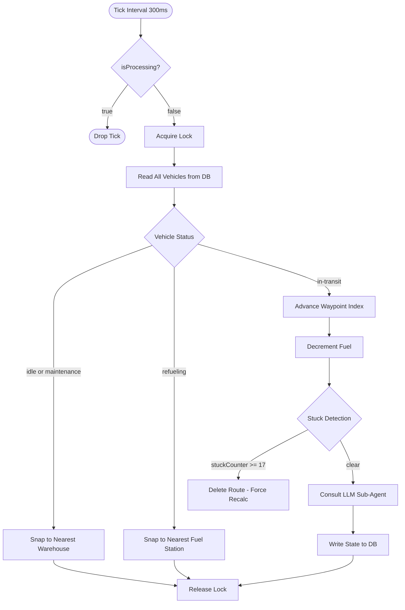
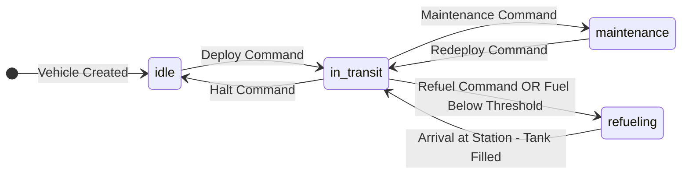
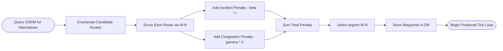
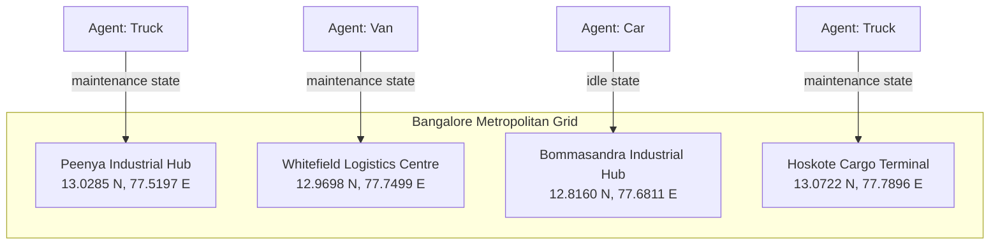
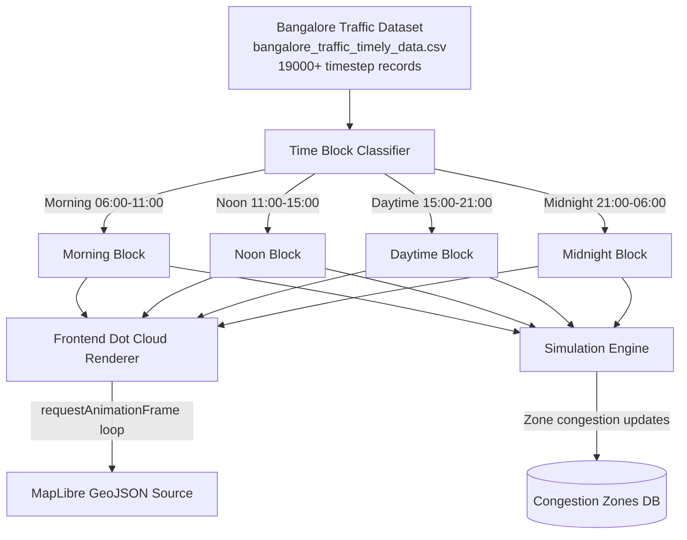

# Logistic Supply Chain Engine

**A deterministic, multi-agent, real-time autonomous routing simulation platform for dense urban logistics networks.**

Built on a hybrid architecture of a high-frequency discrete-time physics engine, graph-based optimal path selection, and LLM-driven agent decision reasoning — operating continuously against live Bangalore traffic data.

---

## Table of Contents

1. [System Architecture](#system-architecture)
2. [Simulation Engine](#simulation-engine)
3. [Agent State Machine](#agent-state-machine)
4. [Optimal Routing Model](#optimal-routing-model)
5. [Traffic Congestion Model](#traffic-congestion-model)
6. [Warehouse and Facility Topology](#warehouse-and-facility-topology)
7. [Data Pipeline](#data-pipeline)
8. [Technology Stack](#technology-stack)
9. [Local Setup](#local-setup)

---

## System Architecture

The platform is structured as a layered system. The presentation layer communicates exclusively through REST contracts with the backend logic layer. The simulation engine operates independently of the HTTP request cycle and persists its state to an embedded relational store.



---

## Simulation Engine

The engine runs as a singleton server-side process at **3.3 Hz** (one tick every 300 ms). Each tick applies physical constraints, advances positions along OSRM-resolved waypoint graphs, evaluates AI agent decisions, and persists the resulting state to the SQLite store.

A mutex semaphore prevents tick pile-up under compute saturation:



### Positional Advancement per Tick

Given vehicle class-based velocity $V_{base}$, a congestion coefficient $C_d \in [0, 1]$, and a time-scale multiplier $S$:

$$D_{tick} = V_{base} \cdot C_d \cdot \frac{\Delta t}{3600} \cdot S$$

Where $\Delta t = 0.3$ seconds and $S = 8$ (simulation speed scale). The result $D_{tick}$ is the distance in kilometers the agent must traverse per tick. The engine iterates the OSRM waypoint graph, consuming this budget across sequential arc segments.

---

## Agent State Machine

Each vehicle agent is governed by a five-state deterministic finite automaton. Transitions are triggered either by explicit operator commands from the Fleet Command Console or by autonomous decisions from the LLM sub-agent layer.



### State-to-Facility Binding Rules

| State | Physical Constraint | Destination |
|---|---|---|
| `idle` | Snapped to nearest warehouse | Nearest logistics hub |
| `maintenance` | Snapped to nearest warehouse | Nearest logistics hub |
| `refueling` | Snapped to nearest fuel station | Nearest petrol bunk |
| `in-transit` | Free movement along OSRM graph | Active destination |

---

## Optimal Routing Model

When an agent is initialized or rerouted, the engine evaluates all candidate route alternatives returned by the OSRM service. Each route is scored through a composite penalty function:

$$W(R) = \sum_{j=1}^{m} D(N_{j-1}, N_j) + \beta \sum_{k=1}^{n} I(O_k, R) + \gamma \sum_{c=1}^{q} C(Z_c, R)$$

Where:

- $D(N_{j-1}, N_j)$ is the travel duration between adjacent waypoints.
- $I(O_k, R)$ is the incident penalty for route $R$ passing within 500 m of incident $O_k$.
- $C(Z_c, R)$ is the congestion zone penalty for route $R$ entering zone $Z_c$ of severity $\ge$ High.
- $\beta, \gamma$ are tunable severity weights.

The route with the minimum $W(R)$ is selected and its waypoints persisted to the vehicle's `current_route_json` column.



---

## Traffic Congestion Model

Congestion levels for spatial zones are computed dynamically on each simulation tick. The base congestion is derived from time-block historical data (Morning, Noon, Daytime, Midnight), drawn from the Bangalore district traffic dataset. A stochastic noise term and vehicle density contribution are applied:

$$\text{Congestion}(Z, t) = \text{Base}(Z, t) + \delta \cdot \text{VehicleDensity}(Z) + \epsilon$$

Where:

- $\text{Base}(Z, t) \in \{25, 55, 85\}$ corresponds to Low, Medium, and High historical congestion classes.
- $\delta = 2$ is the per-vehicle congestion contribution weight within zone radius $\le 0.01$ degrees (~1 km).
- $\epsilon \sim \mathcal{U}(-4, 4)$ is a continuous uniform noise term providing temporal liveness.

The final computed value is clamped to $[10, 100]$ and persisted per zone.

---

## Warehouse and Facility Topology

All fleet maintenance and idle vehicles are geospatially anchored to the nearest registered logistics hub. The nearest facility is resolved via Euclidean proxy distance in degree-space:

$$\hat{F} = \arg\min_{F_i \in \mathcal{F}} \sqrt{(\phi - \phi_i)^2 + (\lambda - \lambda_i)^2}$$

This approximation is valid for small offsets within a single metropolitan region. For cross-region accuracy, the full Haversine formulation is applied:

$$d(p, F_i) = 2R \arcsin\left(\sqrt{\sin^2\!\left(\frac{\phi_i - \phi}{2}\right) + \cos\phi\cos\phi_i\sin^2\!\left(\frac{\lambda_i - \lambda}{2}\right)}\right)$$

### Registered Bangalore Logistics Facilities



---

## Data Pipeline



---

## Technology Stack

| Layer | Technology | Purpose |
|---|---|---|
| Frontend Framework | Next.js 15 (App Router) | Server-side rendering, API routes |
| Map Rendering | MapLibre GL | Geospatial vector tile rendering |
| Styling | Tailwind CSS | Utility-first component styling |
| Animation | Framer Motion | State-transition and entry animations |
| Persistence | better-sqlite3 | Synchronous embedded relational store |
| Routing Engine | OSRM (Public Instance) | Real-road waypoint resolution |
| LLM Sub-Agents | GLM-4.5 Air | Autonomous reroute / refuel decisions |
| Language | TypeScript | Type-safe implementation across all layers |

---

## Local Setup

**Prerequisites:** Node.js 20+, npm, internet access for OSRM and tile endpoints.

```bash
# Clone the repository
git clone https://github.com/vsrupeshkumar/Logistic-Supplychain-Engine.git
cd Logistic-Supplychain-Engine

# Install dependencies
npm install

# Configure environment variables
cp .env.example .env.local
# Edit .env.local and provide required API keys

# Start the development server
npm run dev
```

The application will be available at `http://localhost:3000`. The simulation engine initializes automatically on the first API call and maintains its tick loop for the duration of the server process.

---

## License

This project is submitted for academic and hackathon evaluation purposes. All rights reserved by the contributing authors.


